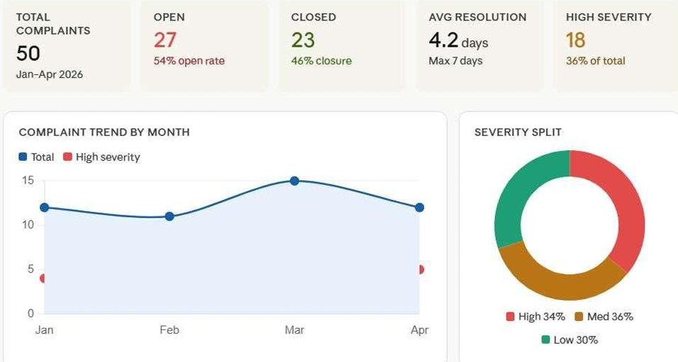
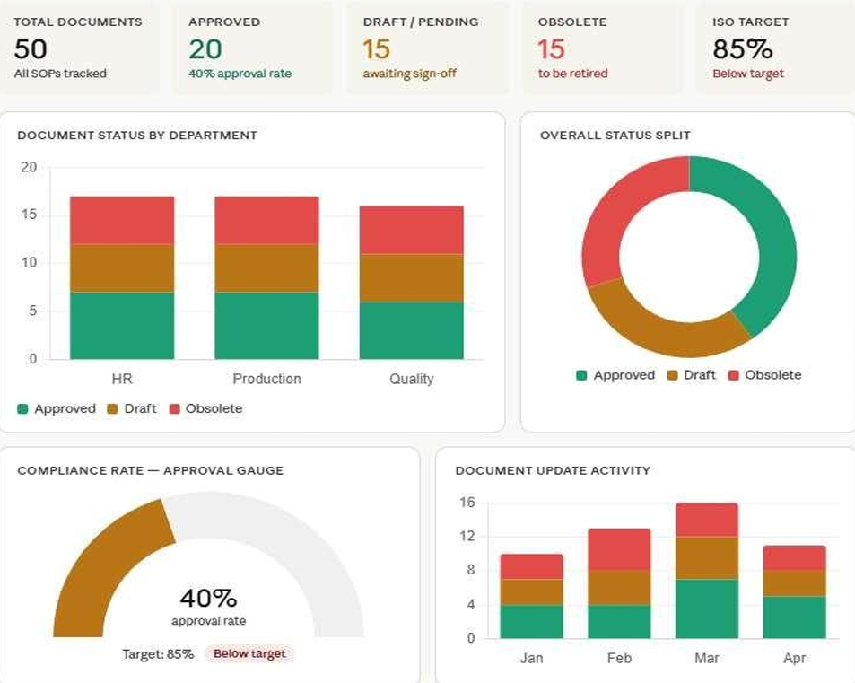
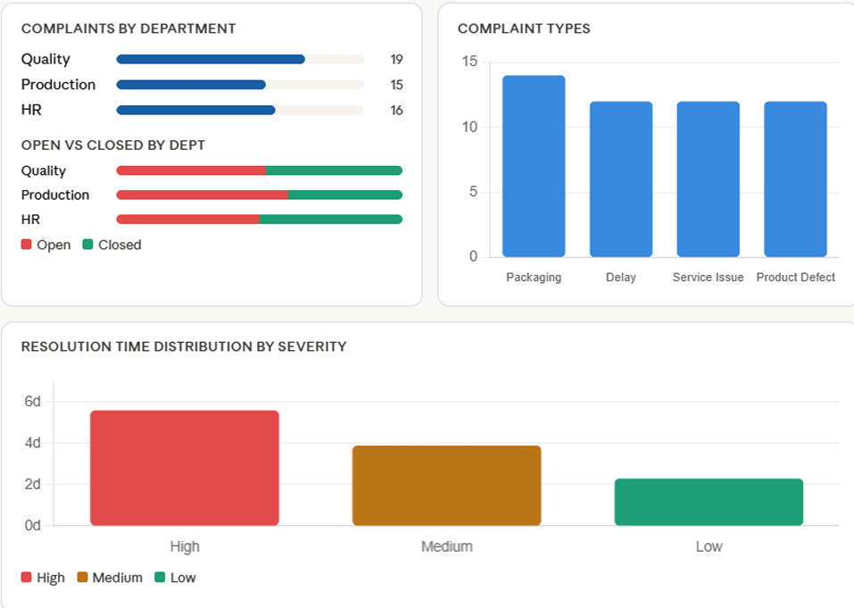

# ISO Compliance Dashboard (Demo)

A web-based dashboard system designed for monitoring ISO documentation workflows, compliance tracking, reporting, and operational visibility.

> Note: This repository contains a demo/personal implementation created for learning and portfolio purposes without any confidential organizational data.

---

## Features

- ISO documentation tracking
- Compliance workflow monitoring
- KPI dashboard
- Reporting modules
- Admin dashboard
- Status tracking system

---

## Tech Stack

- HTML
- CSS
- JavaScript
- Firebase / MySQL

---

## Modules

- Documentation Management
- Compliance Tracking
- Dashboard Analytics
- Workflow Monitoring
- Reporting System

---

## Screenshots

---

## Future Improvements

- Advanced analytics integration
- Role-based access control
- Automated reporting
- Power BI integration
